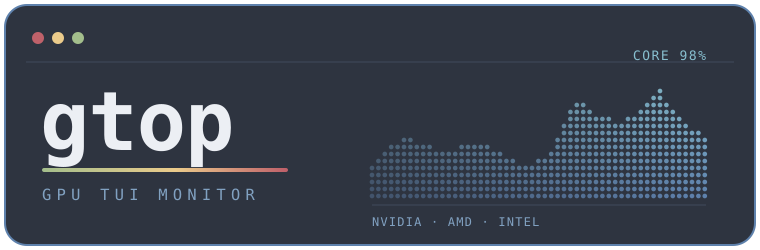
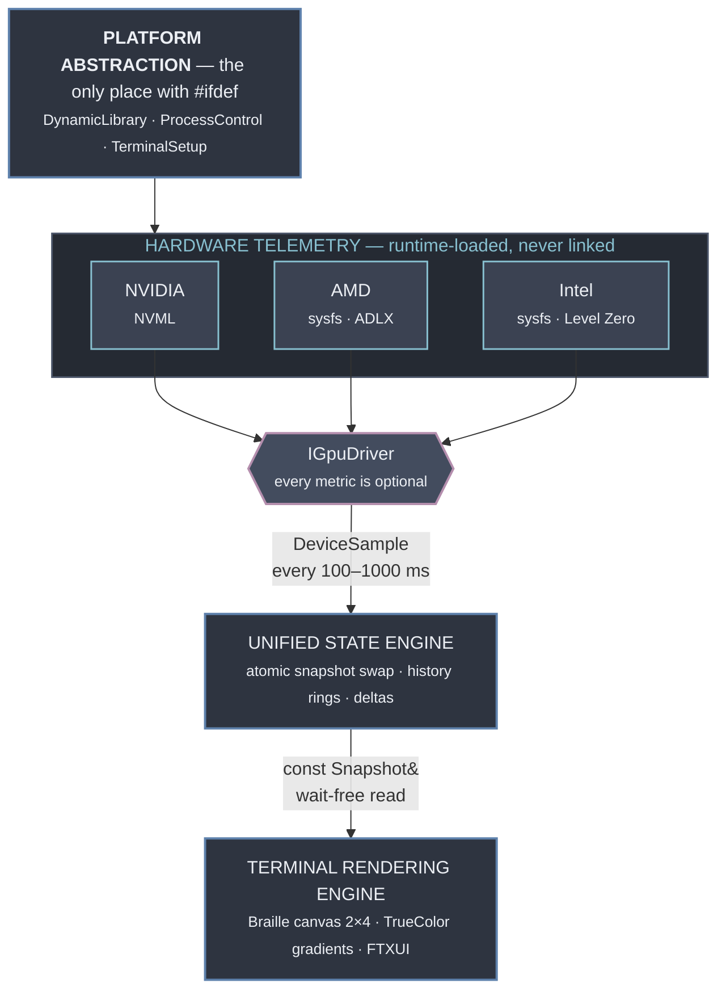
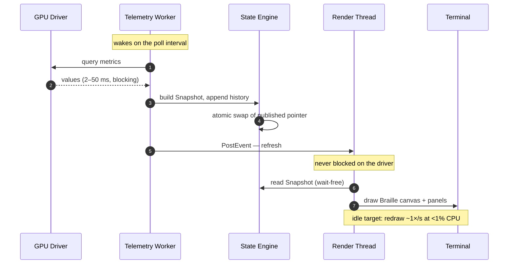
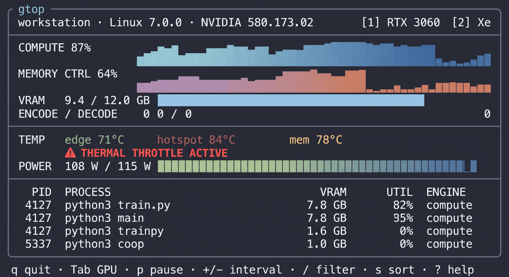

<p align="center">
  
</p>

<p align="center">
  <strong>A btop-style terminal monitor for your GPU.</strong><br>
  Sub-pixel Braille graphs, vendor-agnostic telemetry, and zero driver dependencies.
</p>

<p align="center">
  
  
  
</p>

<p align="center">
  
  
  
  
</p>

<p align="center">
  
  
  
  
  
</p>

---

> ### Project status: pre-implementation
>
> **There is no source code in this repository yet.** What exists today is a
> complete engineering plan — [`ROADMAP.md`](ROADMAP.md) — covering architecture,
> 122 tracked tasks across 9 phases, vendor API entry points, and the traps worth
> knowing before writing a line of code.
>
> Everything below describes what gtop **is being built to do**, not what it
> currently does. Nothing here is installable yet. Watch the repo if you want to
> know when M1 lands.

---

## Why gtop

Standard system monitors tell you a GPU is "87% utilized" and stop there. That
number is nearly useless for the workloads people actually run on GPUs today.

A long training run doesn't fail because utilization was low — it fails because
the card silently thermal-throttled at hour six, or because VRAM crept up until
an allocation failed, or because a stale process from a crashed job still holds
four gigabytes. None of that is visible in a single percentage.

gtop is built to surface the things that actually matter:

| | |
| --- | --- |
| **Sub-engine activity** | Compute, memory controller, encoder, and decoder tracked separately — a video pipeline and a tensor workload look nothing alike |
| **Throttle state, prominently** | Thermal, power, and reliability throttling shown as a badge the moment it engages, not buried in a number that drifts |
| **Power against the real limit** | Draw plotted against the *enforced* TGP, which is what actually constrains you — not the sticker rating |
| **Per-process VRAM** | Which PID is holding your memory, sortable, with the ability to signal it |
| **High-resolution history** | Braille sub-pixel graphs pack 4× the vertical detail of block characters, so brief spikes stay visible |

All of it in a terminal, over SSH, on a headless box, at roughly zero CPU cost.

## Support matrix

Three vendors across two operating systems. **All six cells are in scope for
v1** — none is a stretch goal.

| | Linux | Windows |
| :--- | :--- | :--- |
| **NVIDIA** | NVML · `libnvidia-ml.so.1` | NVML · `nvml.dll` |
| **AMD** | `amdgpu` sysfs + ROCm SMI | ADLX · `amdadlx64.dll` |
| **Intel** | `i915` / `xe` sysfs | Level Zero Sysman · `ze_loader.dll` |
| **Per-process** | DRM fdinfo | PDH GPU counters |

NVML exposes the *same API* on both operating systems — only the filename
differs — so one implementation covers two cells. That is why NVIDIA ships first.

## Architecture

Four layers, one direction of data flow. The platform layer exists so that
supporting Windows never leaks an `#ifdef` into vendor or UI code.



### How a frame happens

Driver calls take anywhere from 2 ms to over 50 ms. If the render thread ever
waits on one, you see it as stutter. So sampling and drawing are fully separated,
and the two threads share state through a single atomic pointer swap — readers
are wait-free and always observe a coherent snapshot, never a half-written one.



## Planned interface

The target layout — a **design mockup**, not a screenshot, since nothing runs yet.

<p align="center">
  
</p>

## Design constraints

These are architectural invariants, not preferences. Each maps to a verifiable
exit criterion in the roadmap.

1. **No vendor library is ever linked at compile time.** NVML, ADLX, ROCm SMI,
   and Level Zero are all resolved at runtime. The binary must start on a machine
   with no GPU and no drivers — verified by checking the link map.
2. **No `#ifdef` outside `src/platform/`.** Vendor and UI code reads as portable
   C++. Enforced by grep in CI.
3. **Every dynamic metric is `std::optional`.** This is what lets six
   heterogeneous vendor/OS combinations render through one UI. Missing telemetry
   shows `—`, never a misleading `0`.
4. **The render thread never calls a driver.** Two threads, one atomic handoff.
5. **A missing dynamic symbol is normal.** Older drivers lack newer entry points;
   that disables one metric, never a whole backend.
6. **Unprivileged by default.** Anything needing root or Administrator degrades
   with a visible hint rather than failing.

## Roadmap

Progress is tracked as 122 checkboxes in [`ROADMAP.md`](ROADMAP.md).

| Phase | Focus | Progress |
| :--- | :--- | :--- |
| 1 | Foundation & platform abstraction | `░░░░░░░░░░` 0 / 17 |
| 2 | Driver abstraction & runtime loading | `░░░░░░░░░░` 0 / 12 |
| 3 | Vendor backends — NVIDIA, AMD, Intel | `░░░░░░░░░░` 0 / 33 |
| 4 | Per-process attribution | `░░░░░░░░░░` 0 / 10 |
| 5 | Braille rendering engine | `░░░░░░░░░░` 0 / 12 |
| 6 | Terminal UI & layout | `░░░░░░░░░░` 0 / 15 |
| 7 | Threading & performance | `░░░░░░░░░░` 0 / 9 |
| 8 | Visual styling | `░░░░░░░░░░` 0 / 5 |
| 9 | Verification & release | `░░░░░░░░░░` 0 / 9 |

**Milestone path:** M1 → M2 → M3 → M4 delivers a working single-GPU monitor
(72 of 122 tasks). Everything after that is breadth across vendors and platforms.

## Building

Not yet possible — Phase 1 establishes the build system. Once it exists, the
intended flow is:

```bash
cmake --preset linux-release      # or: windows-release
cmake --build --preset linux-release
./build/gtop
```

Planned requirements: a C++20 compiler (GCC 12+, Clang 15+, or MSVC 19.36+),
CMake 3.24+, and a terminal with TrueColor and Braille glyph coverage — Windows
Terminal, kitty, alacritty, or WezTerm all qualify. Consolas lacks Braille
coverage, so Windows users should prefer Cascadia Mono.

No GPU SDK is required to build. Vendor headers are vendored for type
definitions only.

## Contributing

The most valuable contribution right now is **hardware access**. The roadmap
covers six vendor/OS combinations, and each needs validation against the vendor's
own tooling. If you have an AMD card on Windows or an Intel Arc discrete GPU,
your `--dump-json` output compared against `rocm-smi` or Task Manager is worth
more than a patch.

Otherwise, start with [`ROADMAP.md`](ROADMAP.md) — pick an unchecked task and
open an issue saying so.

## License

[GPL-3.0](LICENSE)
