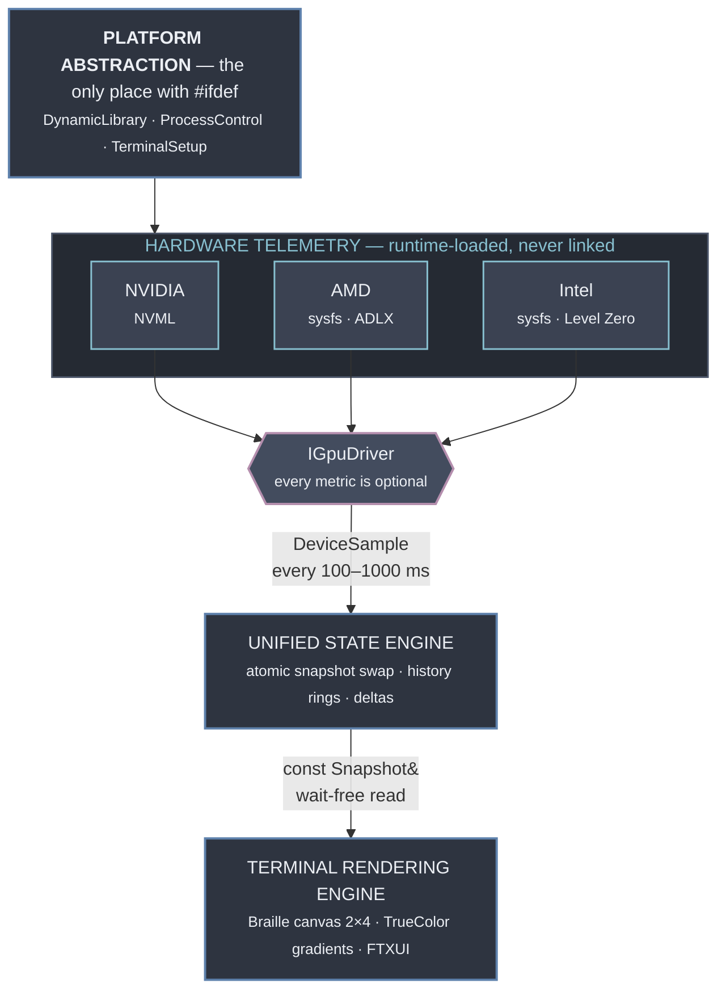
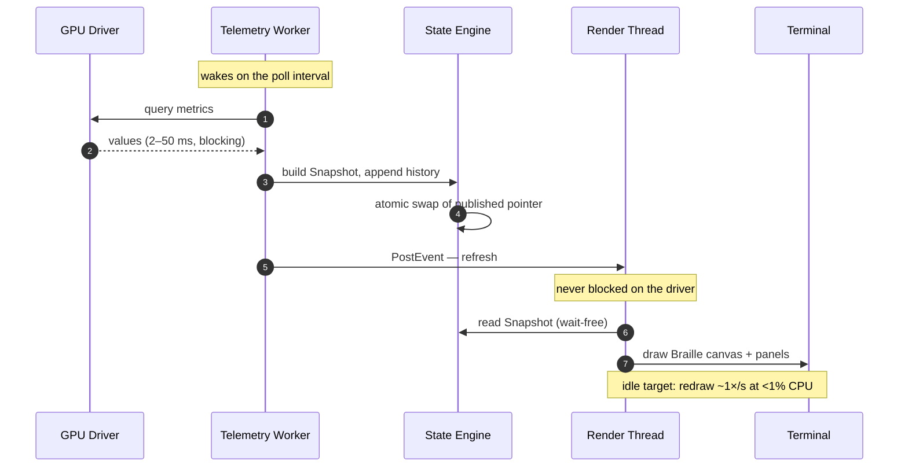

<p align="center">
  
</p>

<p align="center">
  <strong>A btop-style terminal monitor for your GPU.</strong><br>
  Sub-pixel Braille graphs, vendor-agnostic telemetry, and zero driver dependencies.
</p>

<p align="center">
  
  
  
</p>

<p align="center">
  
  
  
  
</p>

<p align="center">
  
  
  
  
  
</p>

---

> ### Project status: platform layer done, no telemetry yet
>
> Phase 1 of the roadmap is complete on Linux: runtime library loading, host
> identity, process control, and terminal capability detection, with tests
> passing under ASan and UBSan. The Win32 sources are written but have not been
> compiled — no Windows toolchain is available yet.
>
> No GPU backend exists, so the binary prints what it detected about the host
> and exits.
>
> [`ROADMAP.md`](ROADMAP.md) carries the plan: architecture, 122 tracked tasks
> across 9 phases, vendor API entry points, and the traps that come with each.
>
> Everything below describes the target. The code does not do it yet, and there
> is nothing installable. Watch the repo if you want to know when M1 lands.

---

## Why gtop

Standard system monitors tell you a GPU is "87% utilized" and stop there. That
number is nearly useless for the workloads people actually run on GPUs today.

A long training run rarely fails because utilization was low. It fails because
the card silently thermal-throttled at hour six, or because VRAM crept up until
an allocation failed, or because a stale process from a crashed job still holds
four gigabytes. None of that is visible in a single percentage.

gtop is built to surface what that percentage hides:

| | |
| --- | --- |
| **Sub-engine activity** | Compute, memory controller, encoder, and decoder tracked separately. A video pipeline and a tensor workload look nothing alike |
| **Throttle state, prominently** | Thermal, power, and reliability throttling raise a badge the moment they engage, instead of showing up as a number that quietly drifts |
| **Power against the real limit** | Draw plotted against the *enforced* TGP, which is the figure that constrains you, rather than the sticker rating |
| **Per-process VRAM** | Which PID is holding your memory, sortable, with the ability to signal it |
| **High-resolution history** | Braille sub-pixel graphs pack 4× the vertical detail of block characters, so brief spikes stay visible |

All of it in a terminal, over SSH, on a headless box, at roughly zero CPU cost.

## Support matrix

Three vendors across two operating systems. All six cells are in scope for v1;
none is a stretch goal.

| | Linux | Windows |
| :--- | :--- | :--- |
| **NVIDIA** | NVML · `libnvidia-ml.so.1` | NVML · `nvml.dll` |
| **AMD** | `amdgpu` sysfs + ROCm SMI | ADLX · `amdadlx64.dll` |
| **Intel** | `i915` / `xe` sysfs | Level Zero Sysman · `ze_loader.dll` |
| **Per-process** | DRM fdinfo | PDH GPU counters |

NVML exposes the same API on both operating systems; only the filename differs.
One implementation covers two cells, which is why NVIDIA ships first.

## Architecture

Data flows one direction. The platform layer exists so Windows support never
leaks an `#ifdef` into vendor or UI code.
[`docs/ARCHITECTURE.md`](docs/ARCHITECTURE.md) has the full layer graph and the
dependency rules.



### How a frame happens

Driver calls take anywhere from 2 ms to over 50 ms. If the render thread ever
waits on one, you see it as stutter. So sampling and drawing are fully separated,
and the two threads share state through a single atomic pointer swap. Readers are
wait-free and always observe a coherent snapshot rather than a half-written one.



## Planned interface

The target layout. This is a design mockup; nothing runs yet.

<p align="center">
  
</p>

## Design constraints

Architectural invariants. Each maps to a verifiable exit criterion in the roadmap.

1. **No vendor library is ever linked at compile time.** NVML, ADLX, ROCm SMI,
   and Level Zero are all resolved at runtime. The binary must start on a machine
   with no GPU and no drivers, which is verified by checking the link map.
2. **No `#ifdef` outside `src/platform/`.** Vendor and UI code reads as portable
   C++. Enforced by grep in CI.
3. **Every dynamic metric is `std::optional`.** This is what lets six
   heterogeneous vendor/OS combinations render through one UI. Missing telemetry
   renders as `—` rather than a misleading `0`.
4. **The render thread never calls a driver.** Two threads, one atomic handoff.
5. **A missing dynamic symbol is normal.** Older drivers lack newer entry points;
   that disables one metric, never a whole backend.
6. **Unprivileged by default.** Anything needing root or Administrator degrades
   with a visible hint rather than failing.

## Roadmap

Progress is tracked as 122 checkboxes in [`ROADMAP.md`](ROADMAP.md).

| Phase | Focus | Progress |
| :--- | :--- | :--- |
| 1 | Foundation & platform abstraction | `█████████░` 16 / 17 |
| 2 | Driver abstraction & runtime loading | `░░░░░░░░░░` 0 / 12 |
| 3 | Vendor backends — NVIDIA, AMD, Intel | `░░░░░░░░░░` 0 / 33 |
| 4 | Per-process attribution | `░░░░░░░░░░` 0 / 10 |
| 5 | Braille rendering engine | `░░░░░░░░░░` 0 / 12 |
| 6 | Terminal UI & layout | `░░░░░░░░░░` 0 / 15 |
| 7 | Threading & performance | `░░░░░░░░░░` 0 / 9 |
| 8 | Visual styling | `░░░░░░░░░░` 0 / 5 |
| 9 | Verification & release | `░░░░░░░░░░` 0 / 9 |

Milestone path: M1 → M2 → M3 → M4 delivers a working single-GPU monitor, 72 of
the 122 tasks. The rest is breadth across vendors and platforms.

## Building

```bash
cmake --preset linux-release      # or windows-release
cmake --build --preset linux-release
ctest --preset linux-release
./build/linux-release/bin/gtop
```

You need a C++20 compiler (GCC 12+, Clang 15+, or MSVC 19.36+) and CMake 3.24+.
Dependency fetching is off by default so a fresh clone configures offline; turn
it on with `-DGTOP_FETCH_DEPS=ON`.

No GPU SDK is required. Vendor headers are vendored for type definitions only.

Rendering needs a terminal with TrueColor and Braille glyph coverage. Windows
Terminal, kitty, alacritty, and WezTerm all qualify. Consolas has no Braille
coverage, so on Windows prefer Cascadia Mono.

## Contributing

The most useful contribution right now is hardware access. The roadmap covers six
vendor/OS combinations, and each needs validation against the vendor's own
tooling. If you have an AMD card on Windows or an Intel Arc discrete GPU, a
`--dump-json` capture compared against `rocm-smi` or Task Manager helps more than
a patch would.

Otherwise, start with [`ROADMAP.md`](ROADMAP.md): pick an unchecked task and open
an issue saying so.

## License

[GPL-3.0](LICENSE)
